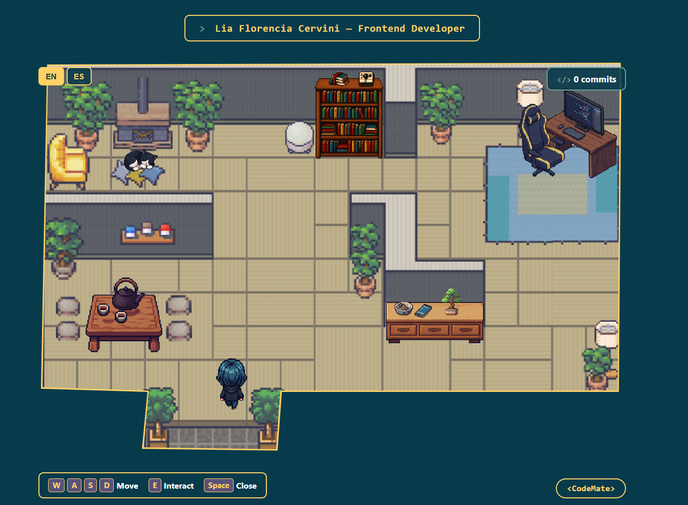
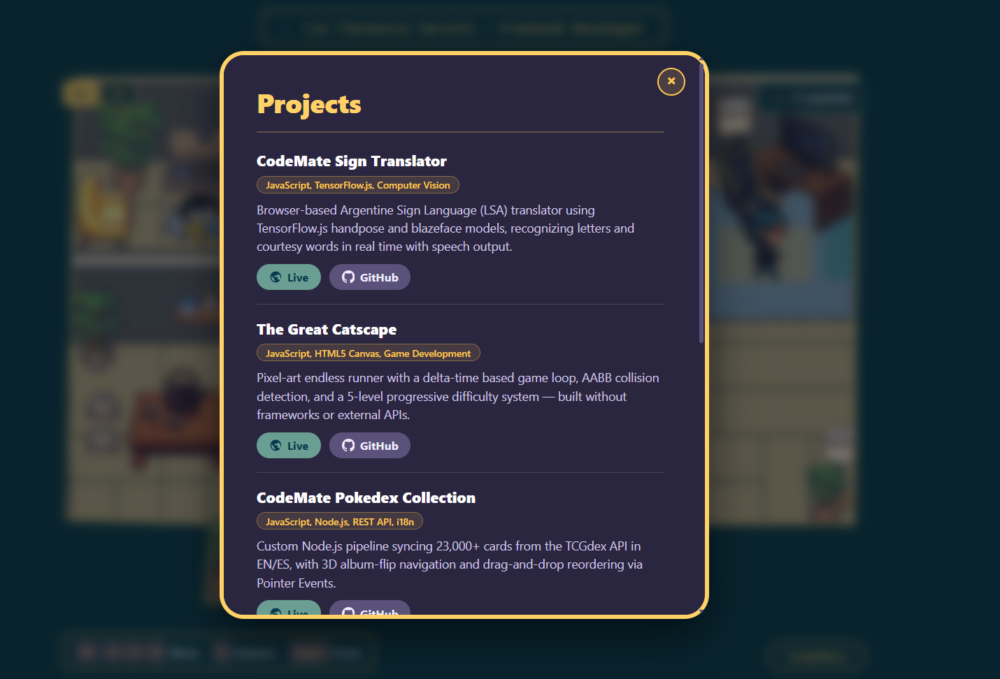
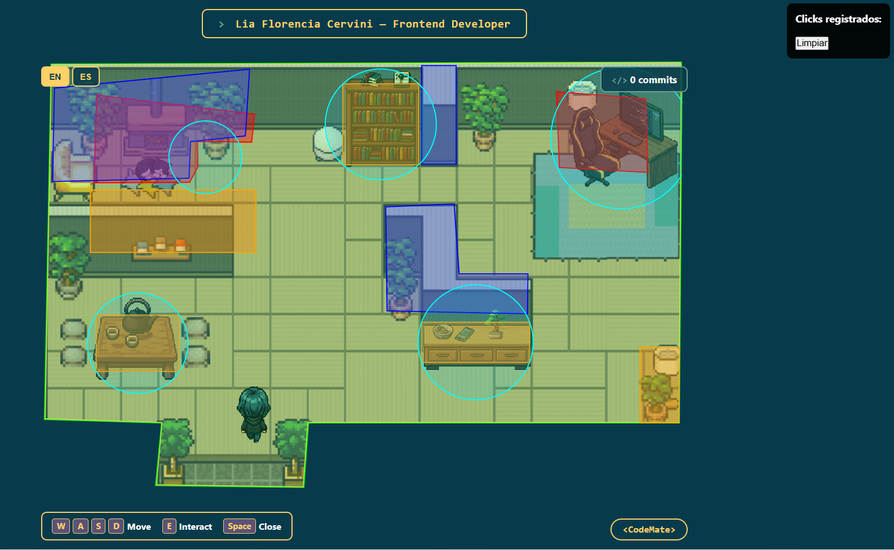

# CodeMate Portfolio Room 🎮

> An interactive pixel-art portfolio you walk through, not scroll through.
> Un portfolio interactivo pixel-art que se recorre caminando, no scrolleando.

**🌐 Language / Idioma:** [English](#english) · [Español](#español)

**Live demo:** [devcodemate.github.io/codemate-portfolio-room](https://devcodemate.github.io/codemate-portfolio-room/)
**Author / Autora:** [Lia Florencia Cervini](https://github.com/devCODEMATE) — Frontend Developer







---

## English

### About

Instead of a traditional scrolling portfolio, this project puts the visitor inside a top-down pixel-art room. You control a character with WASD, walk up to pieces of furniture, and press **E** to open a panel with real content: About Me, Skills, Projects, and Contact. There's also a hidden easter egg — my cat Naga, napping in the corner.

Built to explore React + TypeScript from a vanilla-JS background, and to make a portfolio that's actually memorable in a stack of PDF resumes.

### Features

- 🕹️ **WASD movement** with a hand-calibrated polygon/rectangle collision system (no tile grid — the room is a single background image)
- 💬 **5 interactive stations**: About Me, Skills, Projects, Contact, and a decorative easter egg (Naga)
- 🌐 **EN/ES language toggle**, switching all panel content live
- 📱 **Mobile support** via on-screen touch controls that drive the same input system as the keyboard, with a responsive HUD that adapts down to small phone screens
- 🛠️ **Dev-only debug mode** (press `O` in `npm run dev`) that overlays every collision shape and station hitbox as SVG, plus a click-to-log tool for calibrating new coordinates
- 🚀 **Auto-deploy** to GitHub Pages via GitHub Actions on every push to `main`

### Tech stack

- **React 18 + TypeScript** — component structure and typed data (no framework-level router; everything lives in one `Room` component)
- **Vite** — dev server and build tool
- **Vanilla CSS** — no CSS framework; custom properties for the CodeMate brand palette
- **GitHub Actions** — CI/CD, building and deploying to GitHub Pages on push

No external game engine or physics library — the movement loop, collision detection, and rendering are all hand-built on top of React state and `requestAnimationFrame`.

### Project structure

```
src/
├── assets/
│   ├── room/          # room-background.png (2556×1900px)
│   └── player/         # front/back/side sprites
├── components/
│   ├── Room/           # main game component: movement, collisions, HUD
│   ├── Player/          # directional sprite rendering
│   ├── StationPanel/    # content shown inside each station's modal
│   └── TouchControls/   # on-screen mobile controls
├── data/
│   ├── stations.ts      # station positions, hitbox radii, kind
│   └── translations.ts  # EN/ES copy for HUD + all panels
├── hooks/
│   └── useKeyboard.ts   # ref-based key tracking (avoids re-renders per keypress)
└── types/
    └── station.ts       # Station, StationId, StationKind, Position
```

### Getting started

```bash
git clone https://github.com/devCODEMATE/codemate-portfolio-room.git
cd codemate-portfolio-room
npm install
npm run dev
```

To test on a phone on the same WiFi network:

```bash
npm run dev -- --host
```

Then open the printed **Network** URL from your phone's browser. (Or just visit the live demo link above — no local setup needed to see it on mobile.)

### Building & deploying

```bash
npm run build
```

Runs `tsc -b` (type-check) followed by `vite build`. Every push to `main` triggers `.github/workflows/deploy.yml`, which builds and publishes to GitHub Pages automatically — no manual deploy step needed.

### Controls

| Key | Action |
|---|---|
| `W` `A` `S` `D` | Move |
| `E` | Interact with nearby station |
| `Space` / `Esc` | Close panel |
| `O` (dev only) | Toggle debug view of collision shapes |

### Notes on the collision system

The room has no tile grid — it's a single hand-drawn background image. Walkable area, obstacles, and walls are defined as arrays of polygons and rectangles in `Room.tsx`, calibrated by eye using the debug mode: click on the room while `O` is active, and the exact pixel coordinates get logged to build each shape. Point-in-polygon checks use a standard ray-casting algorithm; obstacles and rects use simple bounding-box checks. Every frame, the next player position is checked against all of these before being applied — if it lands outside the walkable boundary or inside any obstacle, that axis of movement is rejected.

### License

Personal project — feel free to explore the code for learning purposes.

---

## Español

### Sobre el proyecto

En vez de un portfolio tradicional para scrollear, este proyecto ubica a quien lo visita dentro de un cuarto en pixel-art visto desde arriba. Controlás un personaje con WASD, te acercás a distintos muebles, y apretás **E** para abrir un panel con contenido real: Sobre mí, Skills, Proyectos y Contacto. También hay un easter egg escondido — mi gata Naga, durmiendo en un rincón.

Lo construí para meterme en React + TypeScript viniendo de un background de JS vanilla, y para armar un portfolio que realmente se recuerde en una pila de CVs en PDF.

### Funcionalidades

- 🕹️ **Movimiento con WASD**, con un sistema de colisiones de polígonos y rectángulos calibrado a mano (sin grilla de tiles — el cuarto es una sola imagen de fondo)
- 💬 **5 estaciones interactivas**: Sobre mí, Skills, Proyectos, Contacto, y un easter egg decorativo (Naga)
- 🌐 **Selector de idioma EN/ES**, que cambia todo el contenido de los paneles en vivo
- 📱 **Soporte mobile** con controles táctiles en pantalla que alimentan el mismo sistema de input que el teclado, con un HUD responsive que se adapta hasta pantallas chicas de celular
- 🛠️ **Modo debug solo en desarrollo** (tecla `O` en `npm run dev`) que superpone cada forma de colisión y hitbox de estación como SVG, más una herramienta de click-para-loguear coordenadas al calibrar nuevas zonas
- 🚀 **Deploy automático** a GitHub Pages vía GitHub Actions en cada push a `main`

### Stack técnico

- **React 18 + TypeScript** — estructura de componentes y datos tipados (sin router de ningún framework; todo vive en un solo componente `Room`)
- **Vite** — dev server y build tool
- **CSS vanilla** — sin framework de CSS; variables personalizadas para la paleta de marca CodeMate
- **GitHub Actions** — CI/CD, build y deploy automático a GitHub Pages en cada push

Sin motor de juego ni librería de físicas externa — el loop de movimiento, la detección de colisiones y el render están armados a mano sobre el estado de React y `requestAnimationFrame`.

### Estructura del proyecto

```
src/
├── assets/
│   ├── room/          # room-background.png (2556×1900px)
│   └── player/         # sprites frente/espalda/costado
├── components/
│   ├── Room/           # componente principal: movimiento, colisiones, HUD
│   ├── Player/          # render del sprite direccional
│   ├── StationPanel/    # contenido que se muestra en el modal de cada estación
│   └── TouchControls/   # controles táctiles en pantalla
├── data/
│   ├── stations.ts      # posiciones de las estaciones, radio de hitbox, tipo
│   └── translations.ts  # textos EN/ES del HUD y todos los paneles
├── hooks/
│   └── useKeyboard.ts   # tracking de teclas vía ref (evita re-renders por cada tecla)
└── types/
    └── station.ts       # Station, StationId, StationKind, Position
```

### Cómo correrlo

```bash
git clone https://github.com/devCODEMATE/codemate-portfolio-room.git
cd codemate-portfolio-room
npm install
npm run dev
```

Para probarlo en el celular en la misma red WiFi:

```bash
npm run dev -- --host
```

Después abrí la URL de **Network** que imprime la terminal, desde el navegador del celular. (O directamente entrá al link de la demo en vivo de arriba — no hace falta correrlo en local para verlo en mobile.)

### Build y deploy

```bash
npm run build
```

Corre `tsc -b` (chequeo de tipos) y después `vite build`. Cada push a `main` dispara `.github/workflows/deploy.yml`, que compila y publica a GitHub Pages automáticamente — sin ningún paso manual de deploy.

### Controles

| Tecla | Acción |
|---|---|
| `W` `A` `S` `D` | Moverse |
| `E` | Interactuar con la estación cercana |
| `Space` / `Esc` | Cerrar panel |
| `O` (solo dev) | Activar/desactivar la vista debug de colisiones |

### Notas sobre el sistema de colisiones

El cuarto no tiene grilla de tiles — es una sola imagen de fondo dibujada a mano. El área caminable, los obstáculos y las paredes están definidos como arrays de polígonos y rectángulos en `Room.tsx`, calibrados a ojo usando el modo debug: hacés click en el cuarto con `O` activo, y las coordenadas exactas en píxeles quedan logueadas para armar cada forma. Los chequeos de punto-en-polígono usan el algoritmo estándar de ray casting; los obstáculos y rects usan chequeos simples de bounding-box. En cada frame, la próxima posición del jugador se valida contra todo esto antes de aplicarse — si cae afuera del límite caminable o dentro de algún obstáculo, ese eje de movimiento se rechaza.

### Licencia

Proyecto personal — sentite libre de explorar el código con fines de aprendizaje.